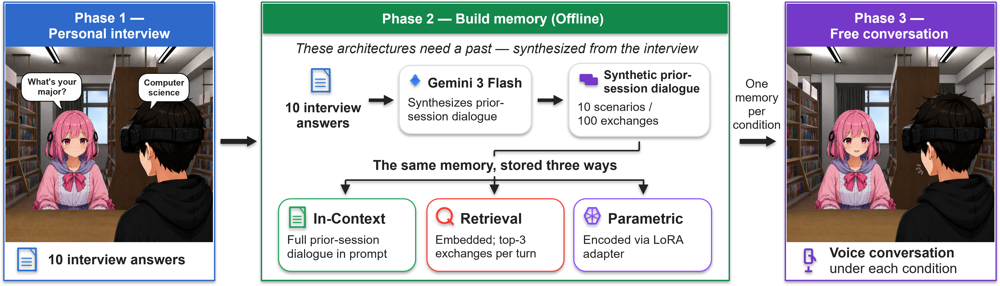

# Remembering Is Not the Same as Feeling Personal: Evaluating Memory Architectures for LLM-Driven VR Embodied Conversational Agents

A research testbed (FastAPI server + Unity/Meta Quest 3 client) that **compares three
long-term-memory (LTM) architectures** for a conversational agent which must recall what a
participant told it in an earlier session. The agent is driven entirely by voice: the Unity
client streams a WAV utterance to a single endpoint (`POST /chat`) and receives recognized
text, the agent's reply, synthesized audio, latency, and token-usage telemetry.

> **Paper:** _(to appear — link / DOI here)_

> **Supplementary material:** [supplementary.pdf](supplementary.pdf)

<p align="center">
  
</p>

---

## Experiment design

- **Three phases**
  - **Phase 1** — a fixed 10-question interview (scripted; no LLM). STT only.
  - **Phase 2** — offline, per-participant build of the three memory artifacts.
  - **Phase 3** — free voice dialog; the agent uses exactly one memory condition.
- **Shared source for fairness.** Phase 2 generates per-participant multi-turn **scenarios**
  (Gemini) from the Phase 1 profile, flattens them to a common 100-exchange (200-turn) transcript, and feeds
  that *same* transcript to all three back-ends.
- **Within-subject, counterbalanced order.** Each participant runs all three conditions; the
  order is assigned from the six possible condition orders as evenly as possible and stored in
  `participants/<pid>/status.json` (`condition_order`). Phase 3 is launched once per condition.
- **No contamination.** Phase 3 dialog is never written back into the memory artifacts; session
  logs live separately under `participants/<pid>/phase3/`.

```
Phase 1  ──>  Phase 2  ───────────────────────────>  Phase 3
interview     Gemini scenarios ─> shared transcript    free dialog,
(STT only)        │                                    one condition
                  ├─ In-Context : memory.json
                  ├─ Retrieval  : FAISS index (embeddinggemma)
                  └─ Parametric : QLoRA-trained adapter (Unsloth) -> GGUF
```

---

## Requirements

- **OS / runtime:** Windows + PowerShell, Python 3.13 (developed and tested on 3.13.7).
- **GPU:** NVIDIA GPU (16 GB target) for Phase 2 (QLoRA training) and Phase 3 (LLM inference).
- **Build toolchain** (to compile the CUDA build of `llama-cpp-python`): NVIDIA **CUDA Toolkit**,
  **CMake**, and the **Visual Studio Build Tools** (C++ compiler).
- **Base model:** `model_weights/gemma-3-4b-it-q4_0.gguf` (GGUF, served via `llama-cpp-python`) — download from [google/gemma-3-4b-it-qat-q4_0-gguf](https://huggingface.co/google/gemma-3-4b-it-qat-q4_0-gguf).
- **Ollama** with `embeddinggemma` pulled (for the **Retrieval** condition).
- **API keys** (commercial services — required to reproduce):
  - `ELEVENLABS_API_KEY` — speech-to-text (Scribe) and text-to-speech.
  - `GEMINI_API_KEY` — Phase 2 scenario generation.

---

## Installation

All commands are PowerShell, run from the repository root.

### Prerequisites (install manually, once)

Install these first — the setup steps below assume they are already present:

1. **Python 3.13** — https://www.python.org (developed on 3.13.7; ensure `python` is on your `PATH`).
2. **CUDA Toolkit + CMake + Visual Studio Build Tools (C++)** — required to compile the CUDA
   build of `llama-cpp-python`. Without a GPU build, Phase 3 inference falls back to CPU and is
   very slow.
3. **Ollama** — https://ollama.ai (the daemon must be running for the Retrieval condition).
4. **Base model** — download `gemma-3-4b-it-q4_0.gguf` from
   [google/gemma-3-4b-it-qat-q4_0-gguf](https://huggingface.co/google/gemma-3-4b-it-qat-q4_0-gguf)
   and place it at `model_weights/gemma-3-4b-it-q4_0.gguf`.
5. **API keys** — an ElevenLabs key and a Gemini key (you'll put them in `.env`, below).

### Setup

```powershell
# 0) Verify Python is on PATH (developed and tested on 3.13.7)
python --version

# 1) Virtual environment + up-to-date packaging tools
python -m venv .venv
.\.venv\Scripts\activate
python -m pip install --upgrade pip wheel setuptools

# 2) Environment file — copy the template, then edit it
copy .env.example .env
#    open .env and set ELEVENLABS_API_KEY and GEMINI_API_KEY

# 3) llama-cpp-python — CUDA build FIRST. It is intentionally NOT in requirements.txt: the
#    default pip wheel is CPU-only and silently disables GPU acceleration. Compiling takes
#    ~5-15 min and needs the CUDA Toolkit + CMake + VS Build Tools.
$env:CMAKE_ARGS = "-DGGML_CUDA=on"
pip install llama-cpp-python --upgrade --force-reinstall --no-cache-dir
#    CPU fallback (very slow): Remove-Item Env:CMAKE_ARGS ; pip install llama-cpp-python

# 4) Remaining dependencies
pip install -r requirements.txt
#    (fastapi, uvicorn, python-dotenv, python-multipart, pyyaml,
#     elevenlabs, faiss-cpu, ollama, numpy, google-genai)

# 5) (Optional) Phase 2 QLoRA-training deps — only the Parametric condition needs these.
#    Skipping them makes a Parametric build raise ImportError.
pip install torch --index-url https://download.pytorch.org/whl/cu126
pip install unsloth trl datasets transformers safetensors huggingface_hub

# 6) Retrieval condition: pull the embedding model (the Ollama daemon must be running)
ollama pull embeddinggemma
```

After setup, confirm `.env` has your keys, the base model is at
`model_weights/gemma-3-4b-it-q4_0.gguf`, and the Ollama daemon is running. Then start a session
(see **Usage** below, or **[QUICK_START.md](QUICK_START.md)** for the full per-participant flow).

### Tested environment

Results were produced on Windows with **Python 3.13.7** and **NVIDIA CUDA 13.0**. Other recent
versions are likely fine; these are the exact versions used.

**Core runtime** (`requirements.txt` + the CUDA `llama-cpp-python` build):

| Package | Version |  | Package | Version |
|---|---|---|---|---|
| llama-cpp-python | 0.3.16 (CUDA) |  | faiss-cpu | 1.13.2 |
| fastapi | 0.135.3 |  | ollama | 0.6.1 |
| uvicorn | 0.44.0 |  | numpy | 2.4.4 |
| python-dotenv | 1.2.2 |  | google-genai | 1.73.1 |
| python-multipart | 0.0.24 |  | pyyaml | 6.0.3 |
| elevenlabs | 2.42.0 |  |  |  |

**Phase 2 QLoRA-training stack** (optional — Parametric condition only):

| Package | Version |  | Package | Version |
|---|---|---|---|---|
| torch | 2.10.0+cu130 |  | safetensors | 0.7.0 |
| unsloth | 2026.4.5 |  | huggingface_hub | 1.10.2 |
| transformers | 5.5.0 |  | peft | 0.19.0 *(via unsloth)* |
| trl | 0.24.0 |  | bitsandbytes | 0.49.2 *(via unsloth)* |
| datasets | 4.3.0 |  | accelerate | 1.13.0 *(via unsloth)* |

---

## Usage

The experiment runs through three entry points. Participant / phase / condition are fixed at
process start via CLI flags — the Unity client never sends them.

```powershell
# Phase 1 — scripted interview server
python server.py -p P001 --phase 1

# Phase 2 — build the three memory artifacts (needs Ollama + GPU)
python build_memory.py -p P001

# Phase 3 — free-dialog server for one condition.
#   -c is an index (0/1/2) into the participant's condition_order.
python server.py -p P001 --phase 3 -c 0

# Reset a participant's data for a phase (stdlib only — runs without the venv)
python reset.py -p P001 --phase {1|2|3} [--condition NAME] [--all] [--yes]
```

Step-by-step operating instructions for a single participant — including troubleshooting and a
per-participant checklist — are in **[QUICK_START.md](QUICK_START.md)**.

### Offline evaluation (no Unity required)

```powershell
python tools/test_conditions_cli.py -p P001                    # factual recall (10 prompts)
python tools/test_conditions_cli.py -p P001 --prompts natural  # natural dialog (7 turns)
python tools/cost_report.py -p P001                            # build wall-clock + Phase 3 runtime
```

---

## VR client (Windows + Meta Quest 3)

The Unity client is distributed as a prebuilt Windows build. It runs on a PC (the
same machine as the server is fine) with a Meta Quest 3 connected over Quest Link /
Air Link. For download, install, server-address setup, and run steps, see
**[RISNSFP_VR_client_setup.md](RISNSFP_VR_client_setup.md)**.

- **Download:** [Dropbox build](https://www.dropbox.com/scl/fo/l8nfwcljrrvn7u8ttk2wo/AMqhsW6hFC4uwfAdu8tDJvo?rlkey=w89z9lsx00wk9as91hbvff3eo&st=xenepomk&dl=0)

---

## Repository layout

```
├── server.py                 # Phase 1/3 server entry point (argparse + uvicorn + log redirect)
├── build_memory.py           # Phase 2 build entry point (Ollama mgmt + Phase2Builder + file logging)
├── reset.py                  # Per-participant / per-phase data reset (stdlib only)
│
├── app/                      # FastAPI core
│   ├── config.py             # Settings (YAML + env)
│   ├── server.py             # create_app + AppState + /chat + shutdown timers
│   ├── pipeline.py           # STT -> agent -> TTS + turn logging
│   ├── store.py              # SessionStore + counterbalanced condition order + usage aggregation
│   ├── phase1_manager.py     # Phase 1 answers.json revision history
│   ├── sanitize.py           # TTS input cleanup (strip emoji / markdown)
│   ├── routes_phase1.py      # /phase1/*
│   └── routes_phase3.py      # /phase3/healthz, /phase3/abort
│
├── agents/                   # Agent interface + Phase 3 memory back-ends
│   ├── base.py               # Agent ABC
│   ├── phase3.py             # Phase3{InContext,Retrieval,Parametric}Agent
│   ├── memory_base.py        # MemoryBase ABC
│   ├── memory_incontext.py   # whole-transcript injection
│   ├── memory_retrieval.py   # FAISS + Ollama embeddinggemma retrieval
│   ├── memory_parametric.py  # QLoRA-trained adapter hot-swap (llama_cpp lora_path)
│   └── _profile.py           # participant display-name extraction (for the system prompt)
│
├── voice/                    # ElevenLabs STT/TTS wrappers + WAV helpers
├── training/                 # Phase 2 tools: scenario generation + QLoRA training + adapter GGUF conversion
├── tools/                    # test_conditions_cli.py, cost_report.py
└── config/                   # default.yaml, phase1_script.yaml, noise.json
```

Generated / private artifacts — `participants/`, `memory_data/`, `model_weights/`,
`voice/voice_cache/`, `outputs/` — and `.env` are git-ignored and **not** part of this repository.

---

## Unity client contract

> **Installing and launching the client:** see **[RISNSFP_VR_client_setup.md](RISNSFP_VR_client_setup.md)**.
> This section documents the wire-level API only.

`participant` / `phase` / `condition` are owned by the server (CLI args); the client never sends
them.

**Phase 3 — `POST /chat`**

- Request: `multipart/form-data`, field `audio` = WAV (16-bit PCM, mono, 16 kHz).
- Response (JSON):
  ```json
  {
    "user_text": "...",
    "agent_text": "...",
    "audio_b64": "<base64 WAV>",
    "latency": {"stt_ms": 0, "llm_ms": 0, "tts_ms": 0, "total_ms": 0},
    "usage": {"stt_audio_sec": 0, "stt_chars_out": 0, "tts_chars_in": 0,
              "tts_cache_hit": false, "llm_prompt_tokens": 0,
              "llm_completion_tokens": 0, "llm_total_tokens": 0,
              "llm_tokens_estimated": false}
  }
  ```
- Auxiliary: `GET /phase3/healthz`, `POST /phase3/abort` (graceful-shutdown timer).

**Phase 1 — Unity-driven navigation** (`/chat` is not registered in this mode)

- `GET  /phase1/manifest` — questions + answer-state snapshot
- `GET  /phase1/audio/{index}` — question WAV (`index` is an integer or `"done"`)
- `POST /phase1/answer/{index}` — `multipart audio=WAV`; stores the STT result (re-send adds a revision)
- `POST /phase1/finish` — 200 + auto-shutdown timer when all answered, else 409
- `POST /phase1/abort` — schedule shutdown without requiring completion
- `GET  /phase1/healthz` — liveness probe

---

## Configuration reference

### Environment variables

| Variable | Default | Notes |
|---|---|---|
| `ELEVENLABS_API_KEY` | (required) | server exits with code 2 if missing |
| `GEMINI_API_KEY` | (required) | needed for Phase 2 scenario generation |
| `ELEVENLABS_VOICE_ID` | `21m00Tcm4TlvDq8ikWAM` | TTS cache is partitioned per voice id |
| `ELEVENLABS_MODEL` | `eleven_multilingual_v2` | TTS model |
| `ELEVENLABS_STT_MODEL` | `scribe_v1` | STT model |
| `PHASE1_SHUTDOWN_DELAY_SEC` | `8` | delay before auto-shutdown after the closing line |
| `HCI_HOST` / `HCI_PORT` | `0.0.0.0` / `8000` | server bind address |

### CLI

`server.py` — `-p/--participant` (required), `--phase {1,3}` (required),
`-c/--c` (condition_order index `0/1/2`, Phase 3), `--host`, `--port`, `--debug`.

`build_memory.py` — `-p/--participant` (required).

`reset.py` — `-p/--participant` (required), one of `--phase {1,2,3}` / `--all`,
optional `--condition NAME` and `--yes` (skip confirmation).

`tools/test_conditions_cli.py` — `-p/--pid` (required), `-t/--temperature` (default `0.7`),
`--prompts {factual,natural}`, `--only {in_context,retrieval,parametric}`.

---

## Reproducibility notes

- **Condition order is deterministic.** A given `pid` always yields the same
  `condition_order`, assigned from the six possible condition orders.
- **Korean is intentional.** The interview script (`config/phase1_script.yaml`), the scenario
  generation prompts, and the agent system prompt are in Korean by design — they are the
  experimental stimulus, not localizable UI.
- **Participant data is not shared.** Real participant artifacts are git-ignored. Any local
  smoke-test artifacts should be treated as private and not committed.

---

## Supplementary material

The supplementary PDF contains the study materials referenced in the paper, including the
Phase 1 interview questions, Phase 2 dialogue-generation prompt, Phase 3 runtime system
prompt, conversation-content coding scheme, questionnaires, and interview materials.

Place the file in the repository root as `supplementary.pdf`.

---

## Third-party acknowledgements

- **llama.cpp** (MIT) — `training/convert_hf_to_gguf.py` and `training/convert_lora_to_gguf.py`
  are vendored from [llama.cpp](https://github.com/ggm