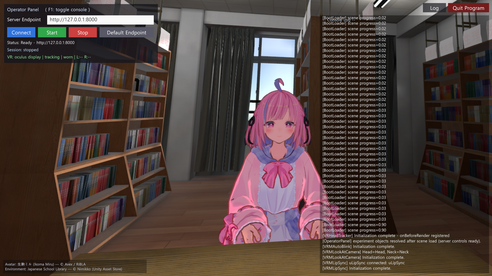
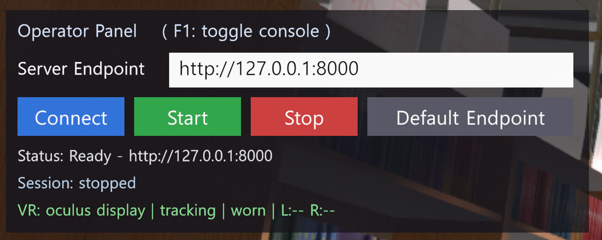
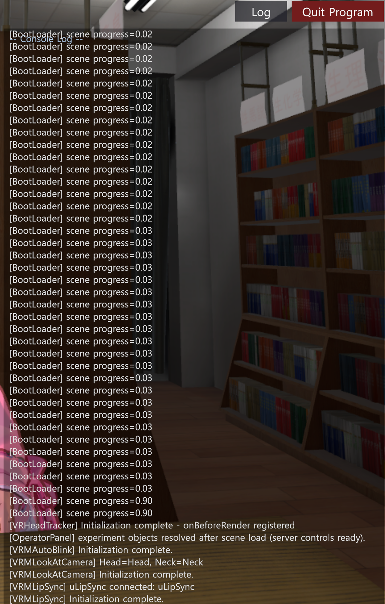

# VR client install and run guide (Windows + Meta Quest 3)

## Overview

This Unity VR client runs the participant-facing VR scene. It displays the avatar and library environment, records the participant's voice, and connects to the FastAPI server.

The server decides the participant, phase, and condition when it starts. The Unity client does not send participant, phase, or condition metadata. Because of that, the same client build can be used for every participant and every condition.

Use the on-screen **Operator Panel** in the top-left corner of the PC window to connect to the server and start or stop a session.



*Operator Panel at top-left. Console log on the right, toggled with F1. Avatar: 生駒ミル (Ikoma Miru) © Avex / RiBLA. Environment: Japanese School Library © Nimikko, Unity Asset Store.*

For the server setup and per-participant flow, see [README.md](README.md) and [QUICK_START.md](QUICK_START.md).

---

## 1. Launch order

Start the headset and server before launching the Unity client.

1. Connect the Meta Quest 3 through Quest Link or Air Link.

   Confirm that the headset is inside the Link / PC-VR environment.

2. Start the server for the participant and phase you are running.

   From the server repository root:

   ```powershell
   # Phase 1: scripted interview
   python server.py -p P001 --phase 1

   # Phase 3: one condition
   # -c is an index into the participant's condition_order
   python server.py -p P001 --phase 3 -c 0
   ```

3. Run the Unity client.

   Double-click the client `.exe`. The VR scene should appear in the headset, and the Operator Panel should appear in the top-left corner of the PC window.

4. Wait until the client is ready.

   The console log may show boot messages such as `[BootLoader]`, `[VRHeadTracker]`, `[VRMLipSync]`, and `[OperatorPanel]`.

   The Operator Panel is ready when the log shows:

   ```text
   experiment objects resolved ... (server controls ready)
   ```

5. For Phase 3, also wait until the server agent is ready.

   The client checks `/phase3/healthz` while the agent is loading. Do not start speaking until the Phase 3 loading status is gone and the avatar scene is fully visible.

---

## 2. Connect and run a session

1. Check the **Server Endpoint** field.

   Use one of the following:

   - Same PC as the server: `http://127.0.0.1:8000`
   - Different PC on the same LAN: `http://<server-PC-IP>:8000`

   If the server runs on another PC, find the server PC IP address with `ipconfig`, keep both machines on the same network, and allow inbound TCP 8000 on the server PC.

2. Click **Connect**.

   Wait until **Status** shows:

   ```text
   Ready - <endpoint>
   ```

3. Check the **VR** line.

   A normal ready state looks like:

   ```text
   oculus display | tracking | worn
   ```

   This means the headset display is detected, tracking is active, and the headset is being worn. The `L` and `R` controller indicators may stay `--` until the controllers wake up.

4. Confirm that the server was started with the intended participant, phase, and condition.

   The Unity client only connects to the server. The server owns the participant, phase, and condition.

5. Click **Start**.

   **Session** changes from `stopped` to running. The participant can now interact in VR with the right-hand controller.

---

## 3. Phase-specific operation

### Phase 1: scripted interview

For each question:

1. Tap **A** to play or replay the current question.
2. Hold the **Trigger** while answering.
3. Release the **Trigger** to submit the answer.
4. Push the joystick left or right to move between questions.
5. After all questions are answered, hold **B** to finish the interview.

If every question has an answer, the server plays the closing line and shuts down automatically after about 8 seconds.

If some questions are unanswered, the panel lists the missing question indices. Move to those questions, record the missing answers, and hold **B** again.

### Phase 3: free conversation

For each turn:

1. Hold the **Trigger** to speak.
2. Release the **Trigger** to send the audio.
3. Wait for the avatar to respond.
4. Speak again only after the avatar finishes.

At the end of a condition:

1. Click **Stop** in the Unity client.
2. Stop the current Phase 3 server process.
3. Start the next condition server with the next `-c` index.
4. Click **Connect**, then **Start** again.

Example Phase 3 condition sequence:

```powershell
python server.py -p P001 --phase 3 -c 0
python server.py -p P001 --phase 3 -c 1
python server.py -p P001 --phase 3 -c 2
```

Use the server console output to confirm which condition each `-c` index maps to.

---

## 4. Controller controls

Right-hand controller only.

| Input | Phase 1 | Phase 3 |
|---|---|---|
| **Trigger** hold and release | Record answer, release to submit | Push-to-talk, release to send |
| **A** tap | Play or replay current question | Not used |
| **Joystick** left / right | Previous or next question | Not used |
| **B** hold | Finish interview | Not used |

---

## 5. Operator Panel reference

The Operator Panel appears at the top-left of the PC window.



| Control | Meaning |
|---|---|
| **Server Endpoint** | Server base URL. Default is `http://127.0.0.1:8000`. |
| **Connect** | Connect to the server at the current endpoint. |
| **Start** | Start the current session after the client is connected. |
| **Stop** | Stop the current Unity client session. |
| **Default Endpoint** | Reset **Server Endpoint** to `http://127.0.0.1:8000`. |
| **Status** | Server connection state. Example: `Ready - http://127.0.0.1:8000`. |
| **Session** | Session state. Usually `stopped` before Start, then running after Start. |
| **VR** | Headset and controller status. Example: `display | tracking | worn | L:-- R:--`. |

---

## 6. Log and quit controls



- **Log** opens the saved run log.
- **Quit Program** exits the Unity client.
- **F1** shows or hides the live console log overlay.

The console log is mainly for debugging. It shows boot progress and component initialization messages such as:

```text
[BootLoader]
[VRHeadTracker]
[OperatorPanel]
[VRMAutoBlink]
[VRMLookAtCamera]
[VRMLipSync]
```

The panel is ready to use after this message appears:

```text
experiment objects resolved ... (server controls ready)
```

---

## 7. Quick checks before starting

Before pressing **Start**, confirm the following:

- The server is running for the correct participant and phase.
- For Phase 3, the server is running with the correct `-c` index.
- **Status** shows `Ready - <endpoint>`.
- **VR** shows display, tracking, and worn.
- The participant is wearing the headset.
- The right-hand controller is awake.
- The avatar and library scene are visible in the headset.

---

## 8. Troubleshooting

| Symptom | Check |
|---|---|
| **Connect** does not reach the server | Confirm the server is running, the endpoint is correct, and TCP 8000 is reachable. |
| **Status** never becomes Ready | Check the server console for startup errors. For LAN use, check firewall and IP address. |
| **VR** does not show tracking or worn | Reconnect Quest Link / Air Link and confirm the headset is inside the PC-VR environment. |
| Controller input does nothing | Wake the right-hand controller and check Quest Link input tracking. |
| Phase 1 cannot finish | Some questions are still unanswered. Check the panel for missing question indices. |
| Phase 3 first turn does not respond | Wait until the server agent finishes loading. Check the server console and the Phase 3 status. |
| Audio is not recognized | Check that the Quest headset microphone is selected in Windows / Meta Quest Link. |
| Console log is hidden | Press **F1**. |
| Need to exit the client | Click **Quit Program**. |

---

## 9. See also

- [README.md](README.md): server setup, installation, and Unity client API contract.
- [QUICK_START.md](QUICK_START.md): full per-participant run-through, including all phases, reset, and checklist.
